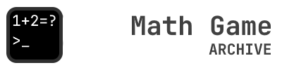

# Math Game Archive 🧮📂


This repository is the **official** archive for all versions of **[Math Game](https://sites.google.com/view/tete-page/project/math-game)**, maintained by the [original creator](https://github.com/ronnapat2552). Here you can safely download and explore the complete development history of the game.<br>

---

## ✨ Repository Features

* 🗄️ **Complete History:** Download every public release of Math Game, from the earliest pre-alpha to the latest version.
* 🔓 **Unreleased Builds:** Access rare, developmental versions (`0.0.1a - V.0.1.4`) for historical or testing purposes.
* 📄 **Source Code Available:** Examine the source code for versions `0.0.1x - 0.3.x`.
* 📜 **Detailed Changelogs:** Track every change, bug fix, and new feature through comprehensive logs.

---

## 📥 Download

### Latest Version
The most recent public release is .

* 🪟 **Windows x64:** [**ZIP Download**](https://raw.githubusercontent.com/ronnapat2552/math_game_archive/main/bin/0.4.x/0.4.2x/math_game_V.0.4.22_np.zip) *(No Python Required)*
* *Note:* There are no native builds for 🍎 **macOS** or 🐧 **Linux**, but it may run using **WINE**.

### All Versions
* **Compiled Builds:** Browse and download all playable builds from the [`/bin` directory](https://github.com/ronnapat2552/math_game_archive/tree/main/bin).
* **Source Code:** Explore the source code for earlier versions (`0.0.1x - 0.3.x`) in the [`/src` directory](https://github.com/ronnapat2552/math_game_archive/tree/main/src).

### Changelogs
* **[Latest Changelog](https://raw.githubusercontent.com/ronnapat2552/math_game_archive/main/doc/change_log.txt)**
* **[Full Version History](https://raw.githubusercontent.com/ronnapat2552/math_game_archive/main/doc/full_change_log.txt)**


---

## 📂 Repository Structure

```
math_game_archive/
├── bin/ # All playable builds, organized by major.minor versions
├── doc/ # Documentation, changelogs, and metadata
└── src/ # Publicly available source code for older versions
```

---

## 🔗 Links

*   🏠 **[Back to Project Home Page](doc/HOME.md)**
*   🏡 **[Main Project Page on Google Sites](https://sites.google.com/view/tete-page/project/math-game)**

---

## 📜 License & Credits

This archive is maintained by [ronnapat2552](https://github.com/ronnapat2552).  
The *Math Game* software and its source code are **© 2023 – 2025 Ronnapat Phawaphootanon**. All rights reserved.

***Note:** This repository is an archive. The software is provided as-is for historical and educational purposes. For issues related to the repository content (e.g., broken links), you can open a GitHub Issue.*
